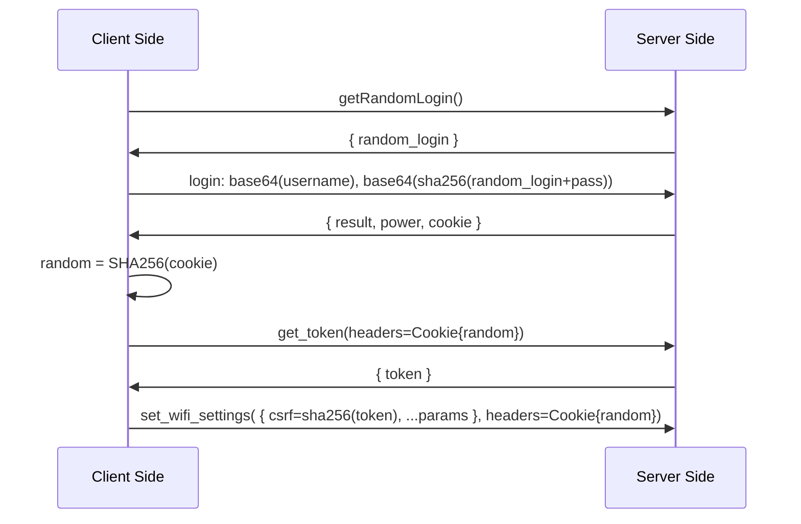

# Router password Changer

## Overview

Change your `Tecno` router password right from your terminal.

## Description

Some internet providers block the ssh/telnet ports from their routers. making it harder for developers to administer their network. The point of this tool is to **avoid using the provided Http GUI** by directly interacting with the internal API of the router, while still maintaining the same level of security.

This has been tested on a `4G Tecno router`

## Requirements

Install all requirements by tunning

```bash
pip install -r requirements.txt
```
## Usage 

```
usage: password_changer.py [-h] [-pp PASSPHRASE] [-a ADMIN] [-p PASSWORD] ssid

positional arguments:
  ssid                  Wifi name.

options:
  -h, --help            show this help message and exit
  -pp PASSPHRASE, --passphrase PASSPHRASE
                        Wifi passphrase (default: randomly generated password)
  -a ADMIN, --admin ADMIN
                        Admin account login. (default: admin)
  -p PASSWORD, --password PASSWORD
                        Admin account password. (default: admin)

```
## General flow

This represents the general flow of this script, following the router flow.



## Todo 

- Add a QR Code generator
- Change the device's wifi password automatically after a successfull passphrase modification
