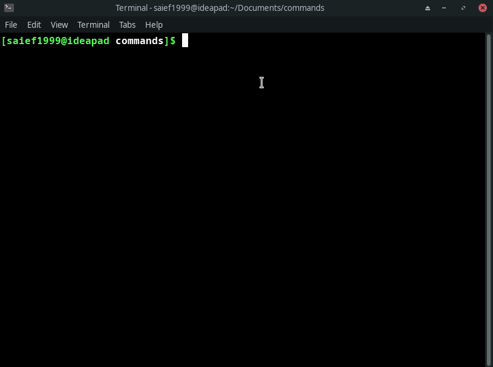
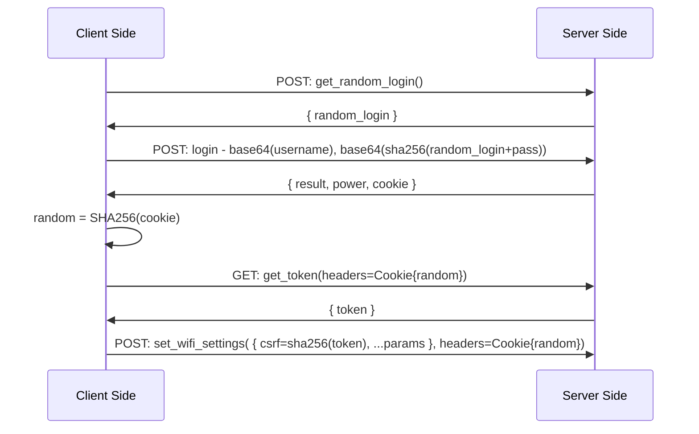

# Router password Changer

## Overview

Change your `Tecno` router password right from your terminal.



## Description

Some internet providers block the ssh/telnet ports from their routers. making it harder for developers to administer their network. The point of this tool is to **avoid using the provided Http GUI** by directly interacting with the internal API of the router, while still maintaining the same level of security.

This has been tested on a `4G Tecno router` on a `manjaro xfce` machine.

## Requirements

### Python requirement
Install all python requirements by running : 

```bash
pip install -r requirements.txt
```
### System requirement

- `nmcli`: in order to change the wifi password & show the qrcode

## Usage 

### Using the python script

**Note**: You need to be connected to the wifi network to use this tool.

```bash
usage: password_changer.py [-h] [-pp PASSPHRASE] [-a ADMIN] [-p PASSWORD]

positional arguments:
  ssid                  Wifi name.

options:
  -h, --help            show this help message and exit
  -pp PASSPHRASE, --passphrase PASSPHRASE
                        Wifi passphrase (default: randomly generated password)
  -a ADMIN, --admin ADMIN
                        Admin account login. (default: admin)
  -p PASSWORD, --password PASSWORD
                        Admin account password. (default: admin)
```

### Using a shell script

A shell script can be used to optimize the usage of this tool. An example has been provided but you can use it as a template for your personal script.

To run it, you need to provide the following arguments:

```bash
chgwifipasswd [passphrase]
```

If no passphrase is provided, a **random** one will be generated.

- `config_path`: Path to the config file, needs to be of format `adminlogin adminpass` (eg: `admin admin` in `wifi.txt`).
- `script_path`: Path to the python script. If you move the shell script you need to update this variable.


## General flow

This represents the general flow of this script, following the router flow.


